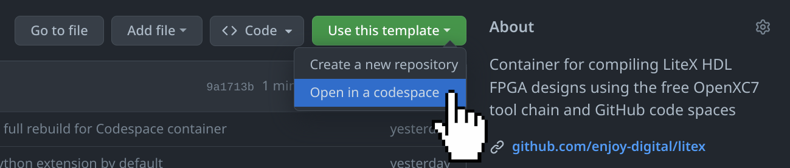

[](LICENSE)

# Containerized LiteX/OpenXC7 Verilog Development Environment for Xilinx FPGAs

[](https://github.com/enjoy-digital/litex)

## Quick Overview

To quickly evaluate this environment, please click on `Use this template`, `Open in a codespace`. Alternatively you can run this environmant locally on your machine using [Podman](https://podman.io/get-started) or [Docker](https://www.docker.com/get-started/) in a pre-installed container.

- Please follow our [Getting started guide](#getting-started) for running the toolchain locally
- [Instruction video for for compiling Verilog Blinky](https://youtu.be/JCctdP_i6y8) using Podman Desktop on Windows
- [Instruction video for compiling a LiteX RISCV CPU Design](https://youtu.be/082bH_Vu2bo) using Cloud-based GitHub Codespaces:
[](../../codespaces)

### LiteX: A Python-based Hardware Description Framework
LiteX is a core element in our FPGA development strategy. It stands out for its Python-based domain-specific language, which significantly simplifies the description of complex digital circuits. Key technical highlights include:

1. **Modular and Configurable**: LiteX offers a modular architecture, allowing for flexible instantiation and configuration of CPU cores, peripherals, and memory controllers.
2. **Automated Bus and Memory Management**: It automates bus interconnects and CSR (Control and Status Register) generation, streamlining memory mapping and control.

### OpenXC7: Open Source Toolchain for Xilinx 7-Series FPGAs
OpenXC7 complements our FPGA toolkit by providing an open-source toolchain specifically for Xilinx 7-Series FPGAs. This toolchain is crucial for:

- **Efficient Synthesis and Place-and-Route Processes**: It facilitates the synthesis of HDL code and the subsequent placement and routing on Xilinx 7-Series FPGA chips.
- **Streamlining FPGA Configuration**: OpenXC7 simplifies the process of configuring FPGAs, making it more accessible and efficient.

## Integrating LiteX with OpenXC7 in our Project

Our project harnesses the power of both LiteX and OpenXC7 to create a robust and efficient FPGA development environment. While LiteX serves as the primary tool for designing and describing hardware components, OpenXC7 is used to implement these designs specifically on Xilinx 7-Series hardware.

- **SoC Design and Implementation**: We use LiteX for the high-level description and generation of SoCs, which are then synthesized and implemented on Xilinx 7-Series FPGAs using OpenXC7.
- **Enhanced Development Workflow**: The combination of LiteX's high-level design capabilities with OpenXC7's efficient toolchain for Xilinx hardware makes our development process more streamlined and powerful.

The integration of LiteX and OpenXC7 thus plays a vital role in our project, offering a comprehensive approach to FPGA design and implementation. The emphasis remains on LiteX for its extensive capabilities in hardware description, while OpenXC7 serves as the essential toolchain for realizing these designs on specific FPGA hardware.

## Getting started ##

The OpenXC7 development environment is a comprehensive toolkit designed for RTL (Register Transfer Level) and HDL (Hardware Description Language) development, specifically tailored for Xilinx Field Programmable Gate Arrays (FPGAs). It integrates various open-source tools, including [YoSYS](https://github.com/YosysHQ/yosys) for synthesis, [NextPNR](https://github.com/openxc7/nextpnr-xilinx) for place and route, and the [OpenXC7](https://github.com/openxc7) project's resources for Xilinx FPGA development. This environment is free and containerized, ensuring a consistent and isolated development setup.

### System Requirements ###

Before installation, ensure your system meets the following requirements:
- **Operating System**: Compatible with most Linux distributions, macOS, and Windows (with WSL2).
- **Hardware**: A minimum of 8GB RAM and 20GB of free disk space.
- **Software Dependencies**: [Podman](https://podman.io/get-started) or [Docker](https://www.docker.com/get-started/) must be installed.

### Installing and Starting the Development Kit ###
The development environment is available as a Docker container, providing an isolated and consistent setup across different systems. It can be run using either Docker or Podman, a daemon-less container engine.

### Docker/Podman Installation ###
- **Docker**: Install Docker from Docker's official website. Ensure it is running on your system before proceeding.
- **Podman**: Alternatively, install Podman from the official Podman website. Podman often sets up a command-line alias to replace 'docker' with 'podman', allowing the use of Docker commands.

### Command Line Installation ###
Use the following command to pull and run the OpenXC7 development container:
```shell
docker run -it ghcr.io/meriac/openxc7-litex:latest
```
For Podman users, either use the docker command if the alias is set or replace 'docker' with 'podman' in the above command.

### Customizing the Development Environment ###

The OpenXC7 development environment can be tailored to suit your specific project requirements. One key aspect of customization is the ability to persist data and access local files. This can be achieved by mounting local directories into the container as volumes. Here's a step-by-step guide to setting this up:

1. **Create a Workspace Directory on Your Local Machine**: This directory will be used to store files that you want to persist or access within the container. 
    ```shell
    # Create a workspace directory
    mkdir workspaces
    ```

2. **Run Docker/Podman with the Workspace Directory Mounted**: Use the following command to start the container with the local `workspaces` directory mounted. This will allow you to access and modify files in this directory from within the container.
    ```shell
    # Run the container with the workspaces directory mounted
    docker run --rm -v $PWD/workspaces:/workspaces:Z --userns=keep-id -it ghcr.io/meriac/openxc7-litex:latest
    ```
    - The `--rm` flag ensures that the container is removed after it's stopped, ensuring that any temporary changes inside the container do not persist.
    - The `-v $PWD/workspaces:/workspaces:Z` option mounts the local `workspaces` directory to the `/workspaces` directory inside the container. 
    - The `:Z` suffix is essential for Linux systems with SELinux enabled, as it sets the correct SELinux context on the mounted volume.
    - The `--userns=keep-id` option ensures that the docker user is mapped to the user running the container

#### Additional Notes on Customization ####
- **Persistent Storage**: Any files saved in the mounted `workspaces` directory will remain on your local machine, even after the container is terminated.
- **SELinux Contexts**: If you're not on a system with SELinux or if it's disabled, the `:Z` option can be omitted.

This setup enhances the flexibility of the development environment, allowing you to maintain a consistent workflow and easily manage project files.

## Resources & Troubleshooting ##
Common issues and their solutions will be documented in the OpenXC7 project's GitHub repository. For specific problems, refer to the respective tool's documentation (YoSYS, NextPNR, Docker/Podman).
- [LiteX Github Repository](https://github.com/enjoy-digital/litex/)
- [OpenXC7 GitHub Repository](https://github.com/openxc7)
- [YoSYS Official Documentation](https://github.com/YosysHQ/yosys#readme)
- [NextPNR GitHub Repository](https://github.com/openxc7/nextpnr-xilinx#readme)
- [Docker Documentation](https://docs.docker.com)
- [Podman Documentation](https://docs.podman.io)

The LiteX/OpenXC7 development environment offers a flexible and robust platform for FPGA development, catering to both beginners and experienced developers in the field.
