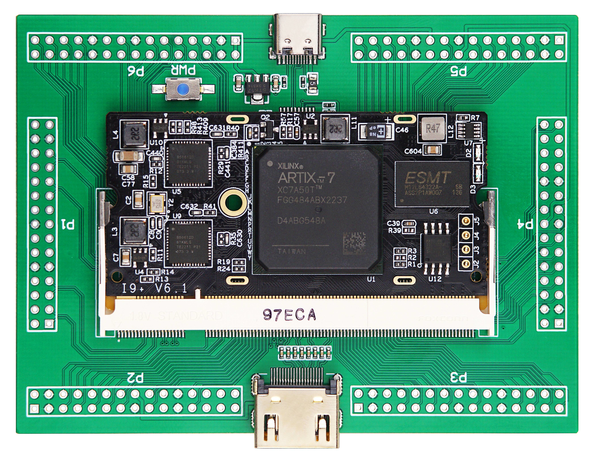

# Using LiteX and OpenXC7 on the ColorLight i9+ platform

## Getting a ColorLight i9+ Module

- Xilinx XC7A50T FPGA RISC-V Development Board Colorlight i9+ Module on [AliExpress.com](https://vi.aliexpress.com/item/1005005620785752.html)
- Make sure to buy at least one "Bundle: i9 Plus Ext Board", so you get the CH347 programming interface mentioned below.
- Please refer to [wuxx/Colorlight-FPGA-Projects](https://github.com/wuxx/Colorlight-FPGA-Projects/blob/master/colorlight_i9plus_v6.1.md) for technical details and [FPGA pinout](https://github.com/wuxx/Colorlight-FPGA-Projects/blob/master/colorlight_i9plus_v6.1.md#ddr2-sodimm-200p).

### Example Projects
- [Blinky](blinky): Simple verilog example code blinking activity LED connected to pin A18. Please follow the [video instructions](https://youtu.be/JCctdP_i6y8) for compiling bitstream on Windows using [Podman containers](../../#installing-and-starting-the-development-kit).
- [RISCV Serial](riscv-serial): LiteX example using a [VexRiscV CPU](https://github.com/SpinalHDL/VexRiscv) - implementing a serial console BIOS. Please check the [video instructions](https://youtu.be/082bH_Vu2bo) for compiling the bitstream using GitHub Codespaces in the Cloud.

### Hardware Overview
- **FPGA:** [XC7A50T-FGG484 Xilinx Artix-7 Series FPGAs Data Sheet](https://docs.xilinx.com/v/u/en-US/ds180_7Series_Overview)
- **SDRAM:** [M12L64322A 8MB SDRAM](https://www.esmt.com.tw/upload/pdf/ESMT/datasheets/M12L64322A(2S).pdf) (512K x 32 Bit x 4 Banks)
- **SPI Flash:** [MX25L128 16MB](https://www.macronix.com/Lists/Datasheet/Attachments/8653/MX25L12835F,%203V,%20128Mb,%20v1.6.pdf)
- **Ethernet PHY:** [1Gb Ethernet PHY Broadcom B50612D](https://github.com/wuxx/Colorlight-FPGA-Projects/blob/master/doc/B50612D-datasheet.pdf) x 2

[](https://github.com/wuxx/Colorlight-FPGA-Projects/blob/master/colorlight_i9plus_v6.1.md)

### Programming ColorLight i9+ using CH347 on Linux using OpenOCD

OpenOCD in already installed in devcontainer, you can use the following commands for programming ColorLight i9+ modules with sudo:
- `ch347prog-sram`: For temporarily programming a bitstream file during development.
- `ch347prog-flash`: For permanently programming a bitstream file.
- `ch347prog-probe`: For detecting the device and the connected flash memory.

### Ensure non-root users can use OpenOCD

To enable non-administrative access to the CH347 chip, it's important to set up a udev rule. After installing [this rule](openocd/99-wch-ch347.rules), you'll need to reconnect the CH347 USB device for the changes to take effect. Use the following command to install the CH347 udev rule:
```shell
sudo install openocd/99-wch-ch347.rules /etc/udev/rules.d/
```

You might need to create a new user group named plugdev in Linux and add the currently logged in user to this group, you would use the groupadd and usermod commands. Here's how you can do it:

1. **Create the plugdev Group:** You need to have superuser (root) privileges to create a new group. Use the groupadd command to create the new group:
```shell
sudo groupadd plugdev
```
1. **Add the Current User to the plugdev Group:** The $USER environment variable in Linux represents the username of the currently logged in user. You can use this variable with the usermod command to add the user to the plugdev group:

```shell
sudo usermod -a -G plugdev $USER
```
- `-a` stands for append. It is used to add the user to the group without removing them from other groups.
- `-G` specifies the group name to which the user is being added.

After running these commands, the currently logged in user will be a member of the plugdev group.
Note that you might need to log out and log back in for the group change to take effect - or even reboot on some systems.

## Deepdive: Understanding the CH347 Chip
- **Interfaces and Modes:** 
  - Provides UART, I2C, and SPI synchronous serial ports, plus a JTAG interface via USB.
  - UART mode includes two high-speed serial ports with RS485 support and hardware flow control.

- **Features:** 
  - 480Mbps high-speed USB device interface.
  - Built-in EEPROM for configurable parameters.
  - Supports 3.3V power supply and housed in a RoHS compliant TSSOP-20 package.

- **JTAG Interface:** 
  - Provides JTAG interface supporting high-speed USB data transfer.
  - Operates a range of devices like CPU, DSP, FPGA, CPLD, and MCU.

- **UART Capabilities:** 
  - Emulates standard UART interface, fully compatible with Windows serial applications.
  - Supports baud rates from 1200bps to 9Mbps, with full duplex and buffer capabilities.

This guide and overview of the CH347 chip's capabilities should provide a solid foundation for using LiteX and OpenXC7 on the ColorLight i9+ platform.
